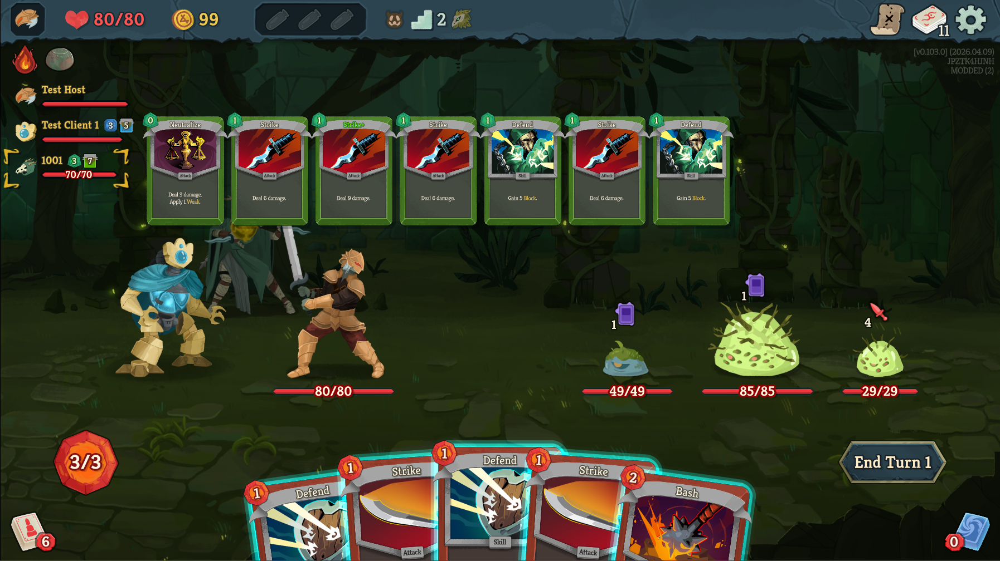

## Open Hand
A multiplayer mod that allows you to peek at the cards a teammate has.  
The mod works client-side, not everyone in the party needs the mod for it to function.

### Installation
Create a folder named `mods` in the same directory as sts2.exe. Then unzip the contents of the release into that folder.
Final structure should look like `...\Slay the Spire 2\mods\OpenHand`

---

